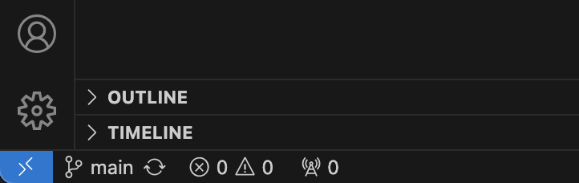

# Working in a Collaborative Git Repository

## Visit the starter repo

1. [Starter Repo for DevOps Bios](https://github.com/mgmt-devops-fa24/devops_bios)

2. Copy the link to the repository

## Clone the repo to your computer

1. In GitHub Desktop, go to `File/Clone Repository...`

2. Choose `URL`
    1. Paste the URL you copied previously
    2. Ensure your Local Path is set to a directory on your computer where you will store your work for this course
    3. Click `Clone`

4. Open the repository for editing in Visual Studio Code (VS Code)

## Create a new branch
There are several ways to create a new branch. We'll do so in the VS Code editor to start.

1. In the lower left corner, you can see the `main` branch is active. Click the branch name (`main`) and choose `+ Create new branch...` from the menu



2. Enter your Purdue username as your branch name and press Enter

3. Confirm that your username is now your active branch name in the lower left portion of the VS Code window

4. In the Explorer tab, copy and paste the file named `_template.html`

5. Rename the new file `{username}.html` and replace your username in the filename

6. Edit the `{username}.html` file to add some new content. Save the file when completed

## Add, Commit, and Push
You'll now perform the add/commit/push cycle, which will do the following:

* Tell Git to track all files in the repository
* Make a **commit** (snapshot, checkpoint, etc.) that preserves your work
* Moves your updates to the GitHub repository

You would normally add files first if using Git on the command line, but VS Code does things a little differently.

1. In VS Code, open the Source Control panel

2. Enter a message in the `Message` field. This should be a descriptive message that specifies precisely which changes have been made since the last commit. Your message might be something like:

```
Added an HTML file for {username}
```

3. Click `Publish Branch`

4. VS Code will ask if you want to "stage all your changes and commit them directly?" Choose `Yes` or `Always`

5. You now see a button labled `🔁 Sync Changes ↑`. Click that button and then press `OK`. Doing this will:
    * Create a branch with your username on the remote repository on GitHub
    * Push your version of the project **to the new remote branch**

## Moving your work into the main branch
You now have your work stored remotely but in a separate branch. You need to request permission to move that work into the `main` branch. You can do that from the GitHub interface.

This is called a "Pull Request" in GitHub, but GitLab uses the term "Merge Request".

1. Visit the [remote repository for the project](https://github.com/mgmt-devops-fa24/devops_bios)

2. From the branches dropdown, you can see all the active branches. Choose the branch that has your username

3. At the top of the screen with your branch selected, you should see a green button labeled `Compare & pull request`. Click that button

4. On the `Open a pull request` screen, fill out the form to explain why your code should be integrated into the `main` branch. Provide it a title like `Added a page for {username}`
    * The description field is where you make your argument why your code should be integrated and/or detail precisely what you did
    * When working in an agile workflow, your pull request will likely be tied to a specific issue to which you were assigned. You'll reference that issue here

5. With your information entered, click `Create pull request`

6. GitHub will now check to see if any of your changes conflict with existing code or other users work. It will result in a button labeled `Merge pull request`. **STOP HERE**

7. **IMPORTANT!!** This is where project management practices come into play. Developers are often not allowed to merge their own requests (they must be reviewed, etc.) These permissions can be established in our GitLab projects later.
    * Normally there is only one developer who is in charge of merging pull requests. This will trigger other processes (building, testing, etc.)

## Cleaning up your local workplace
Different organizations use different processes to manage repositories. To simplify things as we are learning, I recommend the following workflow:

* When a pull request is merged, the remote branch for the user will be deleted
    * This helps keep the remote repository "tidy"
* Developers should compare their local repository with the remote (this is called a *fetch*)
* Developers will then retrieve remote changes and integrate them into their local repository (this is called a *pull*)

Do the following:

1. **DELETE** your local `{username}` branch. The remote repository deleted your branch after the pull request was merged, so it's smart to clean up your local repository to keep it in sync
    1. In GitHub Desktop, click the list of branches
    2. Find your `{username}` branch, right-click it, and choose `Delete...`. Then click `Delete`
    3. If the application asks you if you want to delete the branch from the remote **DO NOT** check the box
        * You haven't synced your local with the remote since the pull request was merged, so there's no remote branch to delete
    4. Click the `Delete` button

2. In GitHub Desktop, click `Fetch origin`

3. After the connection runs, GitHub Desktop will see that there is code on the remote that you don't have locally. It will ask you if you want to retrieve that code. Click `Pull origin`
    * You now have a copy of the remote repository with all the changes locally and ready to work

4. Ready to make more changes? Start the instructions over again by **creating a new branch**