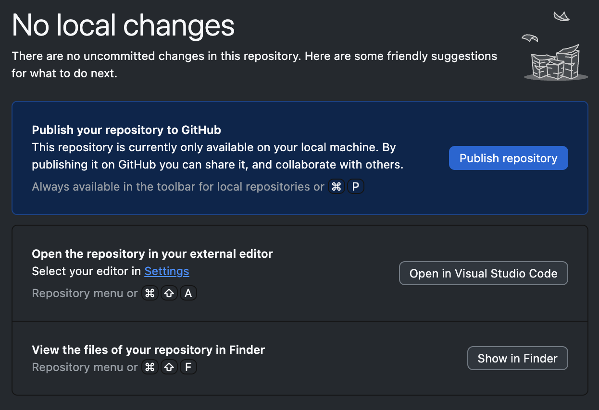

# Creating an Individual Git Repository

## Set up software

1. Open [Git Desktop](https://desktop.github.com/download/})
    1. In `Settings/Accounts`, sign in to GitHub
    2. In `Settings/Git`, ensure your name and email are properly set. Also ensure the Default branch name is set to `main`

2. Ensure [Visual Studio Code](https://code.visualstudio.com/download) is installed

## Create a new repository

1. In GitHub Desktop, choose `File/New Repository...`

2. For repository name, enter `hello_world`

3. Update the Local Path to a directory on your computer where you will store all your work for this course.
    1. The software will create a subdirectory for you

4. Click `Create Repository`

5. You should see the `No local changes` screen because you have an empty repository with no contents



6. Click the `Open in Visual Studio Code` button

## Edit your project
1. In Visual Studio Code (VS Code), click the `New File...` link on the Welcome page or use the `File/New File...` command in the menu

2. Create a file named `README.md` and store it in the directory that was created when you created the repository
    1. The `README.md` file will be packaged with your repository and allows you to explain the purpose and structure of your code.

3. Add the following contents to the file and save it

```
# Hello, World!

This project is to learn how to create a local repository and push it to GitHub.

Why is it called 'Hello, World?' Because that's what you have to do the first time you're learning something new in coding. I don't understand why, but I don't make the rules.
```

4. Create another new file named `index.py`

5. Add the following contents to the file and save it

```
def say_hello():
    print("Hello, World!")

def main():
    say_hello()

if __name__ == "__main__":
    main()
```